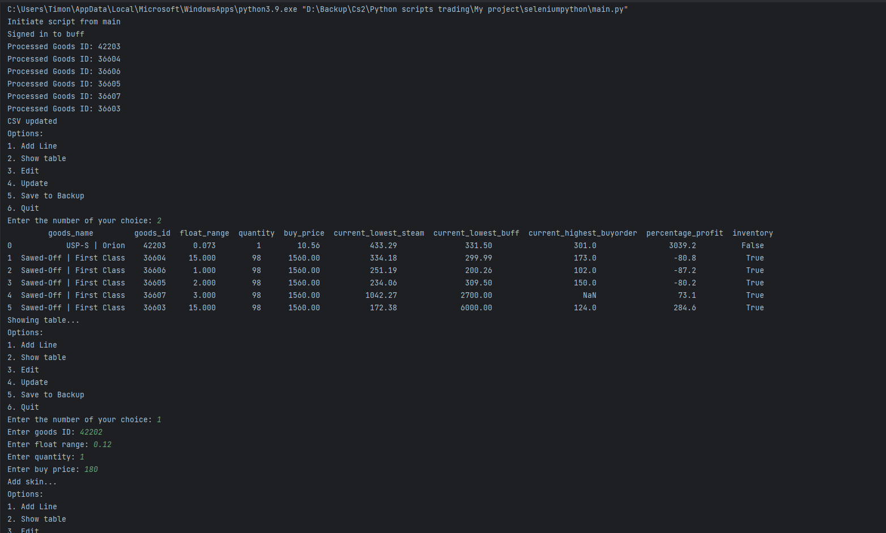

# ItemValueScraper

Item value scraper that signs in automatically if not signed in yet. Whenever the account is signed in the menu starts and the user can select the option he wants.
Script uses selenium, pandas.

Working:
On initiation the items are updated with the current data. 
Item line can be added, show table, edit line, update line/all, save to backup, quit
In every option in the menu has its own functionalities.

It is not a finished product but work in progress.

